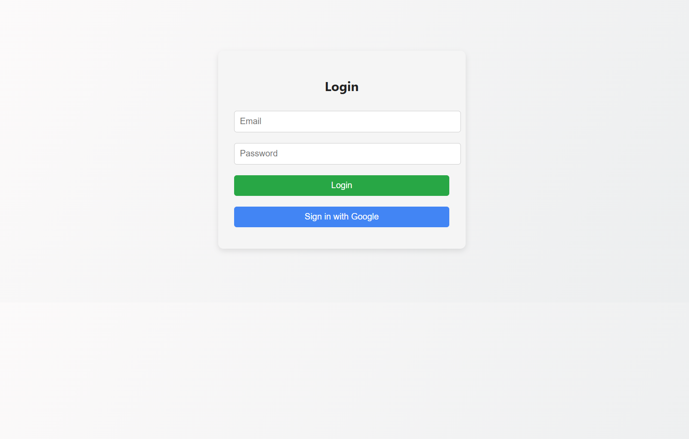
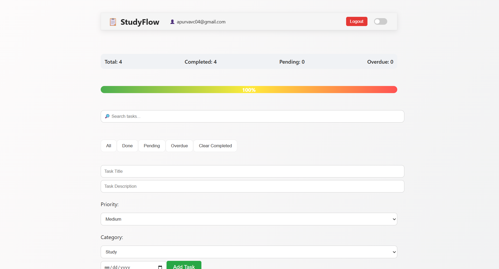
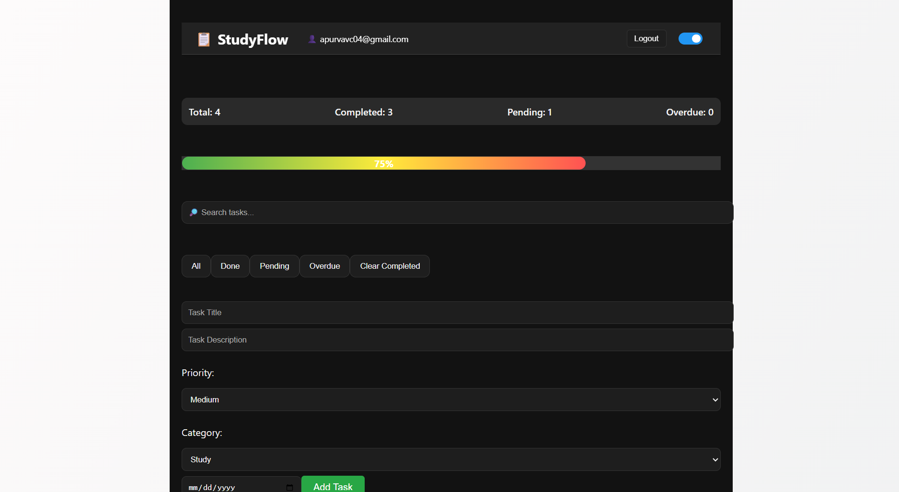
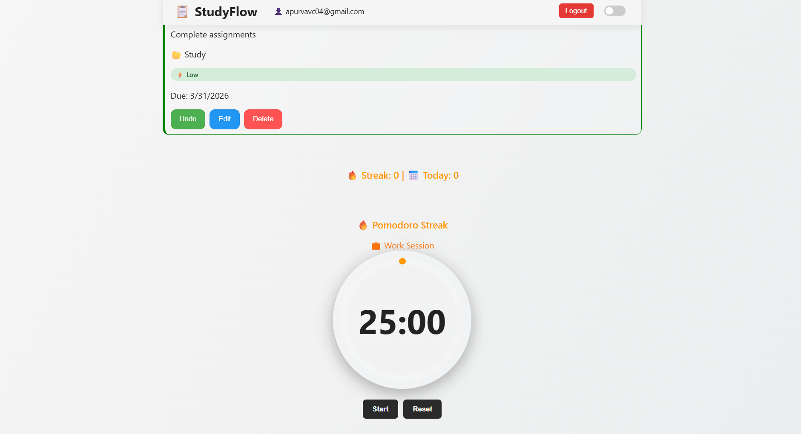

# StudyFlow 📚⚡

**StudyFlow** is a modern productivity web application designed to help students and professionals manage tasks, stay focused, and track productivity.
It combines **task management**, **Pomodoro focus sessions**, and **productivity analytics** in one clean interface.

---

## 🌐 Live Demo

👉 https://productivity-app-prototype.web.app

---

## 🚀 Features

### 📝 Task Management

* Add, edit, and delete tasks
* Assign **categories** to tasks
* Set **priority levels** (High 🔴, Medium 🟠, Low 🟢)
* Add **due dates**
* Mark tasks as **completed**

---

### 🔐 Authentication

* Login using **Email & Password**
* **Google Sign-In** support
* Secure user-based data storage

---

### 🔎 Search and Filtering

* Quickly search tasks
* Filter tasks based on status or category

---

### 📊 Productivity Analytics

* Total tasks overview
* Completed vs pending tasks
* Visual progress bar
* Focus tracking

---

### 🍅 Pomodoro Focus Timer

* Start / Pause / Reset focus sessions
* Helps maintain deep work cycles
* Automatically updates task completion

---

### 🔥 Focus Streak

* Tracks consecutive Pomodoro sessions
* Motivates consistent productivity

---

### 🌙 Dark Mode

* Toggle between **light mode and dark mode**
* Clean and comfortable UI

---

### 📱 Responsive Design

* Works on **desktop and mobile devices**

---

## 🛠 Tech Stack

* **Frontend:** React + Vite
* **Styling:** CSS
* **Backend:** Firebase

  * Firebase Authentication
  * Firestore Database
* **Deployment:** Firebase Hosting
* **Version Control:** Git & GitHub

---

## 📷 Screenshots

### Login


### Dashboard


### Task List


### Dark Mode


### Timer

---

## ⚙️ Installation

Clone the repository:

```bash
git clone https://github.com/apurva1094/productivity-app-prototype.git
```

Go to the project folder:

```bash
cd productivity-app-prototype/client
```

Install dependencies:

```bash
npm install
```

Start the development server:

```bash
npm run dev
```

Open in browser:

```
http://localhost:5173
```

---

## 🚀 Deployment

```bash
npm run build
firebase deploy
```

---

## 📂 Project Structure

```
studyflow/
 ├── client/
 │   ├── src/
 │   ├── public/
 │   └── dist/
 ├── firebase.json
 ├── .firebaserc
 ├── screenshots/
 └── README.md
```

---

## 🎯 Future Improvements

* 🔔 Task reminders & notifications
* 📊 Advanced analytics dashboard
* 🤖 AI-based task suggestions
* 📅 Calendar integration
* 📱 Improved mobile UI

---

## 👨‍💻 Author

**Apurva Chaudhari**

---

## 📜 License

This project is open-source and available under the **MIT License**.

---

## ⭐ Support

If you like this project, consider giving it a **star on GitHub** ⭐
